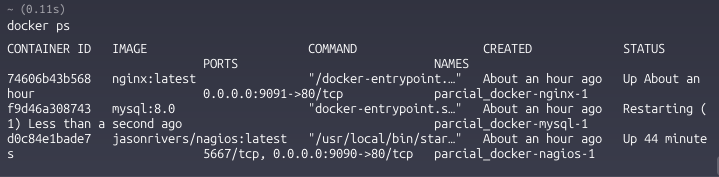
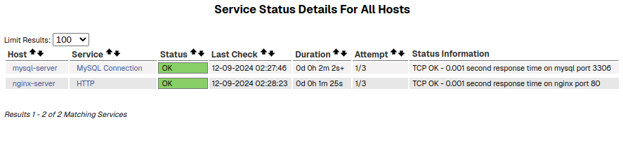

# Monitoreo con Nagios usando Docker 

Sistema de monitoreo utilizando Nagios Core para supervisar servicios MySQL y NGINX en contenedores Docker. 

## Requisitos Necesarios
- Docker
- Docker Compose
- Ubuntu

| Esta practica fue probada en ubuntu desktop 24.04


## Instalacion de Requisitos

1. Instalar Docker:

```bash
sudo apt update
sudo apt install -y apt-transport-https ca-certificates curl software-properties-common
curl -fsSL https://download.docker.com/linux/ubuntu/gpg | sudo apt-key add -
sudo add-apt-repository "deb [arch=amd64] https://download.docker.com/linux/ubuntu $(lsb_release -cs) stable"
sudo apt update
sudo apt install -y docker-ce docker-ce-cli containerd.io
```

2. Instalar Docker Compose:

```bash
sudo curl -L "https://github.com/docker/compose/releases/download/v2.24.0/docker-compose-$(uname -s)-$(uname -m)" -o /usr/local/bin/docker-compose
sudo chmod +x /usr/local/bin/docker-compose
```


## Instalacios de Nagios

Esto sera necesario de configurar si es el caso que no quieres clonar este repositorio donde ya contiene todo

1. Crear la estructura de carpetas 

```bash
Carpeta Principal/
├── docker-compose.yml
├── nagios/
│   └── config/
│       ├── servers/
│       │   ├── mysql.cfg
│       │   ├── nginx.cfg
│       ├── localhost.cfg
│       └── nagios.cfg
├── nginx/
│   └── conf.d/
└── README.md
```

```bash
mkdir -p nagios/config/servers
mkdir -p data/mysql
mkdir -p nginx/conf.d
```

2. Configurar los archivos:

- Ubicados en:
  - nagios/config/nagios.cfg
  - nagios/config/localhost.cfg
  - nagios/config/servers/ngnix.cfg
  - nagios/config/servers/mysql.cfg

3. Iniciar los contenedores:

```bash
sudo docker-compose up -d
docker ps
```
Con el segundo comando podras ver los contenedores que estas encendidos en el momento




### Acceso a la Interfaz
- URL: http://localhost:8080/nagios/
- Usuario: nagiosadmin
- Contraseña: nagios123
### Servicios Monitoreados
MySQL
- Puerto: 3309 (externo), 3306 (interno)
- Credenciales:
    - Usuario: testuser
    - Contraseña: testpass
    - Base de datos: testdb
NGINX
- Puerto: 9091 (externo), 80 (interno)
- Acceso web: http://localhost:8081

Al entrar en nagios en la seccion de servicios o host deberias ver los servicios configurados de la siguiente forma


## Mantenimiento
Reiniciar Servicios
```bash
# Reiniciar todo
sudo docker-compose restart

# Reiniciar servicio específico
sudo docker-compose restart nagios
sudo docker-compose restart mysql
sudo docker-compose restart nginx
```
Verificar Logs
```bash
# Ver logs de todos los servicios
sudo docker-compose logs

# Ver logs de un servicio específico
sudo docker-compose logs nagios
sudo docker-compose logs mysql
sudo docker-compose logs nginx
```
Detener Servicios
```bash
# Detener todos los servicios
sudo docker-compose down

# Detener servicio específico
sudo docker-compose stop nagios
```

## Authors

- [Osnived Padilla](https://github.com/Guandoolo)

